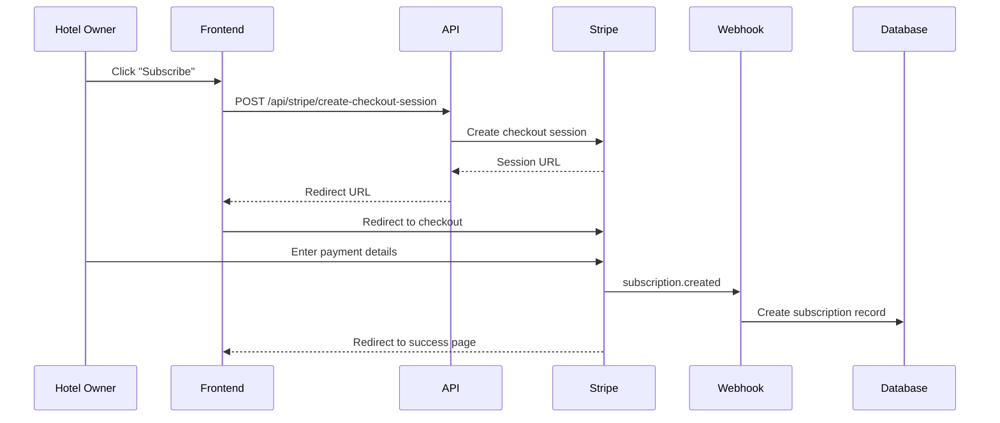
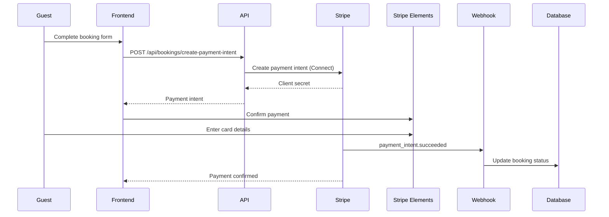

# Stripe Integration Documentation

This document describes the Stripe integration for the Hotelius hotel reservation SaaS platform.

## Overview

The application uses Stripe in two ways:

1. **SaaS Billing**: Subscription-based billing for hotel owners to use the platform
2. **Stripe Connect**: Payment processing for guest bookings with automatic payouts to hotels

## Architecture

```
┌─────────────────────────────────────────────────────────────┐
│                     Stripe Integration                       │
├─────────────────────────────────────────────────────────────┤
│                                                               │
│  SaaS Billing (Platform)      │   Connect (Hotel Payments)   │
│  ─────────────────────────    │   ─────────────────────────  │
│  • Hotel subscriptions         │   • Guest booking payments   │
│  • Monthly/annual plans        │   • Automatic payouts        │
│  • Invoice management          │   • Platform fees (10%)      │
│                                │   • Onboarding flow          │
└─────────────────────────────────────────────────────────────┘
```

## Environment Variables

Add these to your `.env.local` file:

```bash
# Stripe API Keys
NEXT_PUBLIC_STRIPE_PUBLISHABLE_KEY=pk_test_xxx
STRIPE_SECRET_KEY=sk_test_xxx

# Webhook Secrets (get these from Stripe Dashboard)
STRIPE_WEBHOOK_SECRET=whsec_xxx           # For SaaS billing webhooks
STRIPE_CONNECT_WEBHOOK_SECRET=whsec_xxx   # For Connect webhooks

# Supabase (required for database operations)
NEXT_PUBLIC_SUPABASE_URL=https://xxx.supabase.co
NEXT_PUBLIC_SUPABASE_ANON_KEY=xxx
SUPABASE_SERVICE_ROLE_KEY=xxx             # Required for webhooks

# App URL
NEXT_PUBLIC_APP_URL=http://localhost:3000
```

## Database Setup

### 1. Run the Migration

Execute the SQL migration to create the necessary tables:

```bash
# Using Supabase CLI
supabase migration up

# Or manually run the SQL from:
# supabase/migrations/001_add_stripe_tables.sql
```

### 2. Tables Created

- `subscriptions` - Hotel subscription records
- `invoices` - Payment invoices for subscriptions
- `connect_accounts` - Stripe Connect account details
- `payments` - Guest booking payment records
- `payouts` - Hotel payout records

The migration also adds Stripe-related columns to the `hotels` table.

## API Routes

### SaaS Billing Routes

#### 1. Create Checkout Session
**POST** `/api/stripe/create-checkout-session`

Creates a Stripe Checkout session for subscribing to a plan.

```typescript
// Request
{
  "priceId": "price_xxx",      // Stripe price ID
  "hotelId": "uuid",           // Hotel ID
  "plan": "premium"            // Plan name (basic/premium/enterprise)
}

// Response
{
  "sessionId": "cs_xxx",
  "url": "https://checkout.stripe.com/..."
}
```

**Usage:**
```typescript
const response = await fetch('/api/stripe/create-checkout-session', {
  method: 'POST',
  headers: { 'Content-Type': 'application/json' },
  body: JSON.stringify({
    priceId: 'price_1234',
    hotelId: 'hotel-uuid',
    plan: 'premium'
  })
});

const { url } = await response.json();
window.location.href = url; // Redirect to Stripe Checkout
```

#### 2. Create Billing Portal Session
**POST** `/api/stripe/create-portal-session`

Creates a Stripe Customer Portal session for managing subscriptions.

```typescript
// Request
{
  "hotelId": "uuid"
}

// Response
{
  "url": "https://billing.stripe.com/..."
}
```

### Stripe Connect Routes

#### 3. Create Connect Account
**POST** `/api/stripe/connect/create-account`

Creates a Stripe Connect Express account for a hotel.

```typescript
// Request
{
  "hotelId": "uuid",
  "country": "US"  // ISO country code
}

// Response
{
  "accountId": "acct_xxx",
  "detailsSubmitted": false,
  "chargesEnabled": false,
  "payoutsEnabled": false
}
```

#### 4. Create Account Link (Onboarding)
**POST** `/api/stripe/connect/account-link`

Generates an onboarding link for Stripe Connect setup.

```typescript
// Request
{
  "hotelId": "uuid"
}

// Response
{
  "url": "https://connect.stripe.com/setup/...",
  "expiresAt": 1234567890
}
```

#### 5. Create Dashboard Link
**POST** `/api/stripe/connect/dashboard-link`

Generates a login link to the Stripe Express Dashboard.

```typescript
// Request
{
  "hotelId": "uuid"
}

// Response
{
  "url": "https://connect.stripe.com/express/..."
}
```

### Booking Payment Routes

#### 6. Create Payment Intent
**POST** `/api/bookings/create-payment-intent`

Creates a payment intent for a booking with Connect.

```typescript
// Request
{
  "bookingId": "uuid"
}

// Response
{
  "clientSecret": "pi_xxx_secret_xxx",
  "paymentIntentId": "pi_xxx",
  "amount": 10000,           // Total in cents
  "currency": "usd",
  "platformFee": 1000        // Platform fee in cents (10%)
}
```

## Webhook Handlers

### Setup Webhooks in Stripe Dashboard

1. **SaaS Billing Webhook**
   - URL: `https://yourdomain.com/api/webhooks/stripe`
   - Events:
     - `customer.subscription.created`
     - `customer.subscription.updated`
     - `customer.subscription.deleted`
     - `invoice.paid`
     - `invoice.payment_failed`

2. **Connect Webhook**
   - URL: `https://yourdomain.com/api/webhooks/stripe-connect`
   - Events:
     - `account.updated`
     - `payment_intent.succeeded`
     - `payment_intent.payment_failed`
     - `payout.paid`
     - `payout.failed`

### SaaS Billing Webhook
**POST** `/api/webhooks/stripe`

Handles subscription lifecycle events:

| Event | Action |
|-------|--------|
| `customer.subscription.created` | Creates subscription record in database |
| `customer.subscription.updated` | Updates subscription status and billing cycle |
| `customer.subscription.deleted` | Marks subscription as canceled, deactivates hotel |
| `invoice.paid` | Records successful payment |
| `invoice.payment_failed` | Records failed payment, updates status to past_due |

### Connect Webhook
**POST** `/api/webhooks/stripe-connect`

Handles Connect account and payment events:

| Event | Action |
|-------|--------|
| `account.updated` | Updates onboarding status and account capabilities |
| `payment_intent.succeeded` | Confirms booking, marks payment as paid |
| `payment_intent.payment_failed` | Records failed payment attempt |
| `payout.paid` | Records successful payout to hotel |
| `payout.failed` | Records failed payout with reason |

## Webhook Security

All webhooks implement:

1. **Signature Verification**: Validates requests are from Stripe
2. **Idempotency**: Prevents duplicate processing of events
3. **Error Handling**: Returns appropriate status codes
4. **Logging**: Records all events for debugging

```typescript
// Webhook signature verification
const event = constructWebhookEvent(
  requestBody,
  signature,
  webhookSecret
);
```

## Payment Flow

### Subscription Flow (Hotel Owners)



### Booking Flow (Guests)



## Platform Fees

The platform charges a **10% fee** on all bookings with a minimum of **$2.00**.

```typescript
const PLATFORM_FEE_PERCENTAGE = 10;
const PLATFORM_FEE_MINIMUM = 200; // $2.00 in cents

function calculatePlatformFee(amount: number): number {
  const percentageFee = Math.round(amount * (PLATFORM_FEE_PERCENTAGE / 100));
  return Math.max(percentageFee, PLATFORM_FEE_MINIMUM);
}
```

## Connect Onboarding Flow

1. **Create Account**: Hotel owner creates Connect account
2. **Generate Link**: System generates onboarding link
3. **Complete Onboarding**: Hotel owner fills out Stripe form
4. **Webhook Update**: `account.updated` webhook updates status
5. **Enable Payments**: Once complete, hotel can receive payments

```typescript
// Check if hotel can accept payments
const canAcceptPayments = hotel.stripe_onboarding_complete &&
                          hotel.stripe_charges_enabled &&
                          hotel.stripe_payouts_enabled;
```

## Testing

### Test Cards

Use Stripe's test cards for development:

- **Success**: `4242 4242 4242 4242`
- **Decline**: `4000 0000 0000 0002`
- **Requires Authentication**: `4000 0025 0000 3155`

### Webhook Testing

Use the Stripe CLI to test webhooks locally:

```bash
# Install Stripe CLI
brew install stripe/stripe-cli/stripe

# Login
stripe login

# Forward webhooks to local server
stripe listen --forward-to localhost:3000/api/webhooks/stripe
stripe listen --forward-to localhost:3000/api/webhooks/stripe-connect

# Trigger test events
stripe trigger customer.subscription.created
stripe trigger payment_intent.succeeded
```

## Error Handling

All API routes and webhooks implement comprehensive error handling:

```typescript
try {
  // Process request
} catch (error) {
  console.error('[API] Error:', error);

  if (error instanceof Error) {
    return NextResponse.json(
      { error: error.message },
      { status: 500 }
    );
  }

  return NextResponse.json(
    { error: 'Internal server error' },
    { status: 500 }
  );
}
```

## Security Considerations

1. **Never expose secret keys** to the client
2. **Always verify webhook signatures** before processing
3. **Use service role client** in webhooks to bypass RLS
4. **Implement idempotency** to prevent duplicate operations
5. **Validate user ownership** before operations
6. **Log all webhook events** for audit trail

## Monitoring

Monitor these metrics:

- Failed webhook deliveries
- Payment success/failure rates
- Subscription churn
- Payout status
- Connect onboarding completion rates

## Support

For Stripe-related issues:

1. Check [Stripe Dashboard](https://dashboard.stripe.com) logs
2. Review webhook delivery attempts
3. Test with Stripe CLI
4. Contact Stripe support for payment issues

## File Structure

```
src/
├── app/
│   └── api/
│       ├── webhooks/
│       │   ├── stripe/route.ts              # SaaS billing webhooks
│       │   └── stripe-connect/route.ts      # Connect webhooks
│       ├── stripe/
│       │   ├── create-checkout-session/route.ts
│       │   ├── create-portal-session/route.ts
│       │   └── connect/
│       │       ├── create-account/route.ts
│       │       ├── account-link/route.ts
│       │       └── dashboard-link/route.ts
│       └── bookings/
│           └── create-payment-intent/route.ts
├── lib/
│   ├── stripe.ts                    # Stripe utilities
│   ├── stripe-types.ts              # TypeScript types
│   └── supabase/
│       ├── client.ts                # Client-side Supabase
│       ├── server.ts                # Server-side Supabase
│       └── service.ts               # Service role client
└── types/
    ├── database.ts                  # Base database types
    └── database-extended.ts         # Extended with Stripe tables
```

## Next Steps

1. Configure webhook endpoints in Stripe Dashboard
2. Set up subscription plans and pricing
3. Customize checkout success/cancel pages
4. Add email notifications for payment events
5. Implement subscription upgrade/downgrade logic
6. Add analytics and reporting dashboards
